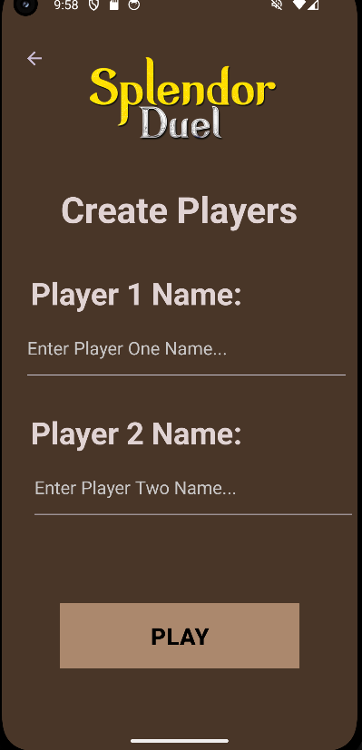
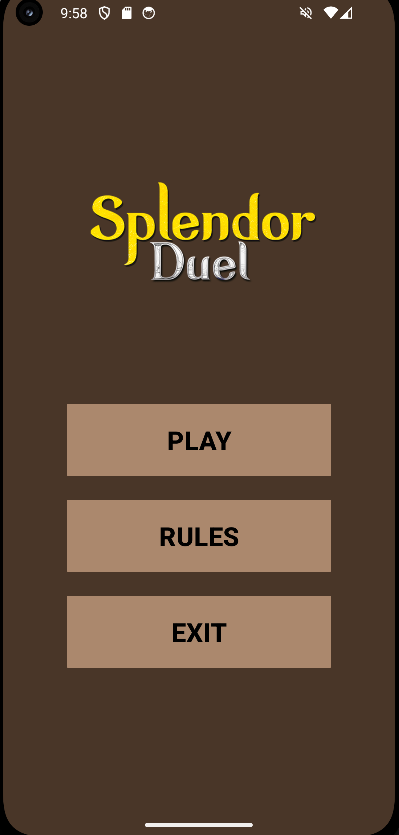
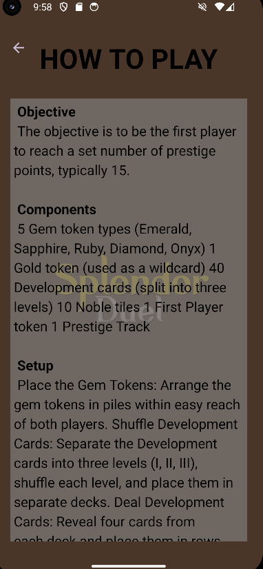

# 🎮 Splendor Duel - Android App

A mobile adaptation of the **Splendor Duel** board game built as a **team project** by 4 people using **Java** in **Android Studio**.

This app aims to bring the competitive and strategic nature of Splendor Duel to mobile devices in a clean and intuitive way.

---

## 👥 Team

- Built by a team of 4 members  
- Collaboration was key in implementing game logic and designing UI components

---

## 🛠️ Tech Stack

- **Language:** Java  
- **IDE:** Android Studio  
- **Platform:** Android  
- **UI:** XML Layouts with **GridLayout**  
- **Game Mechanics:** Programmed according to Splendor Duel board game rules  
- **Custom UI Components:** Extended `Button` class to create custom game buttons

---

## 🎯 Features

- 🪙 Token collection and card purchasing  
- 💎 Player turn management  
- 🧠 Implementation of different winning conditions  
- 📱 Custom-designed UI for interactive gameplay using **GridLayout**  
- 🔘 Custom buttons created by extending `Button` class  
- 🔄 Game state management and transitions

---

## 🚀 How to Run

1. Clone the project (or open the local project folder in Android Studio)
2. Build the project using **Gradle**
3. Run it on an emulator or connected Android device

---

## 🧠 What We Learned

- Android app development workflow  
- Java object-oriented design for game logic  
- XML layouting and **GridLayout** usage  
- Creating reusable components by **extending Button class**  
- Turn-based game state handling  
- Collaboration and task division in a small dev team

---

## 📸 Screenshots / Preview

